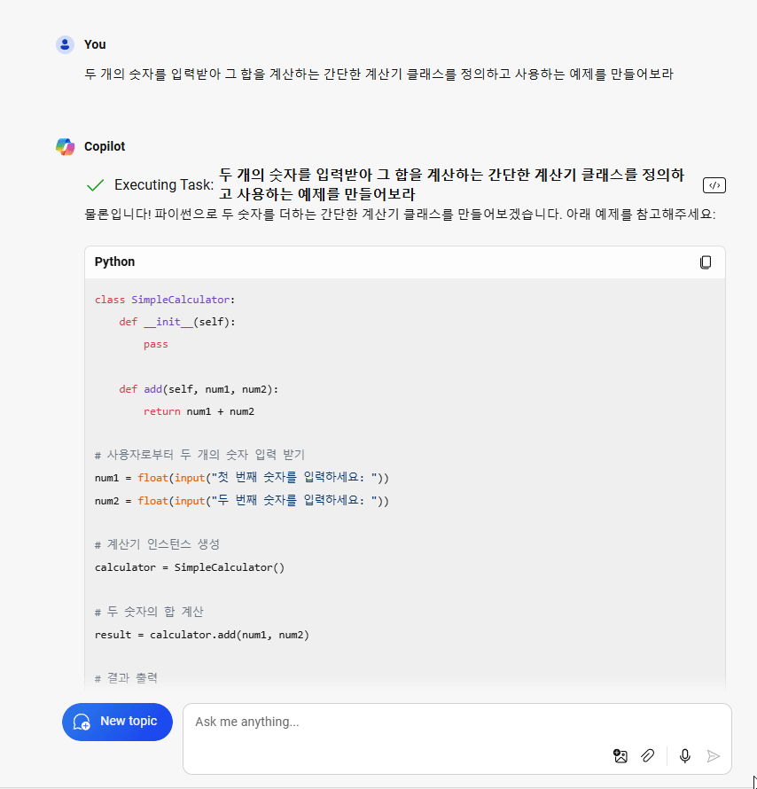

# 생성형 인공지능(GenAI, Generative AI) 등장
## GenAI 등장과 변화
1. 기존 교육 방식  
   기존 기술 및 개발에 관한 교육은 일단 문서를 읽고, 처음부터 끝까지 따라해보는 방식이었습니다. 가령, `Hello World`를 출력하는 프로그램을 만들 때, `Hello World`를 출력하는 코드를 보고, 이해하고, 따라해보는 방식이었습니다.  

   파이썬으로 프로그래밍을 배운다고 하면 먼저 아래와 같이 `Hello World`를 출력하는 코드를 배우게 됩니다.
   ```python
    print("Hello World")
    ```
   
    그 다음으로 변수를 배우게 되죠. 변수를 배우면 아래와 같이 변수를 사용한 코드를 만들어 볼 수 있습니다.
    ```python
    a = 1   # a라는 변수에 1을 할당 
    print(a)    # a를 출력
    ```

    그러면 다음으로 조건문을 만드는 방법과 자료형에 대한 이해를 통해 변수를 활용한 간단한 프로그램을 만드는 단계로 이동하게 되죠.
    ```python
    a = 1
    b = 2
    if a > b:
        print("a가 b보다 크다")
    else:
        print("a가 b보다 작다")
    ```
    이런 식으로 단계적으로 배워나갑니다.

    그 다음에 함수를 만드는 방법과 클래스를 만드는 방법을 배우게 되죠. 이런 식으로 단계적으로 전체를 하나씩 배워나갑니다.
    ```python
    def add(a, b):
        return a + b
    ```
    ```python
    class Calculator:
        def __init__(self, a, b):
            self.a = a
            self.b = b
        def add(self):
            return self.a + self.b
    ```

    다음으로 위 'Calculator'라는 클래스를 만들어서 프롬프트로 입력값을 받아 덧셈하는 프로그램을 만들어 보려면 또 새로운 코드를 추가해야 합니다.
    ```python
    a = int(input("a: "))
    b = int(input("b: "))
    calc = Calculator(a, b)
    print(calc.add())
    ```
    이 부분을 추가해야 하고, 덧셈 프로그램을 완성하자면 다음과 같이 됩니다.
    ```python
    class Calculator:
        def __init__(self, a, b):
            self.a = a
            self.b = b
        def add(self):
            return self.a + self.b

    a = int(input("a: "))
    b = int(input("b: "))
    calc = Calculator(a, b)
    print(calc.add())
    ```
    이를 calculator.py라는 파일로 저장한 후 python으로 실행하면 아래와 같이 실행됩니다.
    ```bash
    $ python calculator.py
    ```
    이걸 배운다 하더라도 원하는 프로그램을 만드는 것은 요원합니다. 그래서, 이런 방식으로 배우다보면 새로운 것들을 응용해서 만들 때 어려움을 겪기 일수고 전문 프로그래미로 나가지 않으면 결국 원하는 걸 만들지 못하고 결국 포기하게 되는 경우가 많습니다.  

    포기하지 않는 분들은 '검색'을 통해서 원하는 걸 흉내내며 만들어갑니다.
    검색을 하다보면 환경설정이 서로 달라서 예시로 만든 코드가 동작하지 않는 경우가 많습니다. 그래서, 이런 경우에는 다시 검색을 하면서 환경설정을 맞추는데 시간을 많이 소비하게 됩니다.
    
    이것이 전통적인(conventional) 교육 방식이었습니다.

2. 생성형 인공지능 등장과 교육 방식의 변화
   생성형 인공지능은 '검색'이 아닌 '생성'이 핵심입니다. 생성형 인공지능을 상대로 '검색'하던 습관을 버리지 못하는 경우를 허다하게 봤습니다. 그만큼 관성을 버리기 힘이 들어서 이지 않을까 싶습니다.  
   > **"생성형 인공지능은 검색이 아닌 생성이 핵심입니다."**

   검색과 생성의 확연한 차이를 아래 예시를 통해 살펴보겠습니다.
   - 검색: 자기가 원하는 것을 자기가 검색을 통해서 구현
   - 생성: 자기가 원하는 것을 생성형 인공지능에게 요청하고, 생성형 인공지능이 자동으로 생성  

   생성형 인공지능 시대에는 내가 무엇을 만드려고 하고, 왜 만드려고 하는 지가 훨씬 중요해졌습니다.  
   왜 만드려고 하는 지가 중요한 까닭은 이런 컨텍스트를 통해 생성형 인공지능이 더 나은 결과를 만들어 줄 수 있기 때문입니다.  
   
   노우하우(know-how)는 중요하지만, 노우하우보다 노우와이(know-why)가 더 중요해졌습니다.  
   문제점을 잘 발굴하면 노우하우는 생성형 인공지능을 활용해서 쉽게 문제를 해결할 수 있습니다.  

   프롬프트를 잘 만드는 것이 중요해지면서 프롬프트를 잘 만드는 것을 '엔지니어링'이라고 부르며 '프롬프트 엔지니어'라는 직업이 생겼습니다.

   앞서 생성한 아래 코드를 복사한 다음 코파일럿(Copilot)에게 붙여넣고 ```다음의 코드들에 대해서 설명을 하라```고 프름프트를 입력해서 요청을 해봅니다.
   ```python
    class Calculator:
        def __init__(self, a, b):
            self.a = a
            self.b = b
        def add(self):
            return self.a + self.b

    a = int(input("a: "))
    b = int(input("b: "))
    calc = Calculator(a, b)
    print(calc.add())
    ```

    코파일럿은 다음과 같이 답을 하네요.
    > ## Copilot
    > 이 코드는 두 개의 숫자를 입력받아 그 합을 계산하는 간단한 계산기 클래스를 정의하고 사용하는 예제입니다. 코드를 살펴보겠습니다:
    > 1. `Calculator` 클래스를 정의합니다. 이 클래스는 두 개의 숫자를 인자로 받아 객체를 초기화합니다.
    > 2. `add` 메서드는 두 숫자의 합을 반환합니다.
    > 3. 사용자로부터 두 개의 숫자를 입력받고, `Calculator` 클래스를 생성하여 두 숫자의 합을 출력합니다.
    > 간단한 예시로, 사용자가 3과 5를 입력하면 결과로 8이 출력될 것입니다. 이 코드는 객체 지향 프로그래밍의 기본 개념을 보여주는 예시입니다.
    > : 이 코드는 객체 지향 프로그래밍의 기본 개념을 보여주는 예시입니다. 실제로는 더 복잡한 계산기를 만들 때 사용할 수 있습니다.


    반대로 이제는 코파일럿에게 ```두 개의 숫자를 입력받아 그 합을 계산하는 간단한 계산기 클래스를 정의하고 사용하는 예제를 만들어보라```고 요청해봅니다.
    
    

## GPT-4o 등장
1. GPT-40
2. 위기는 기회
## 창업 환경의 변화와 적응
