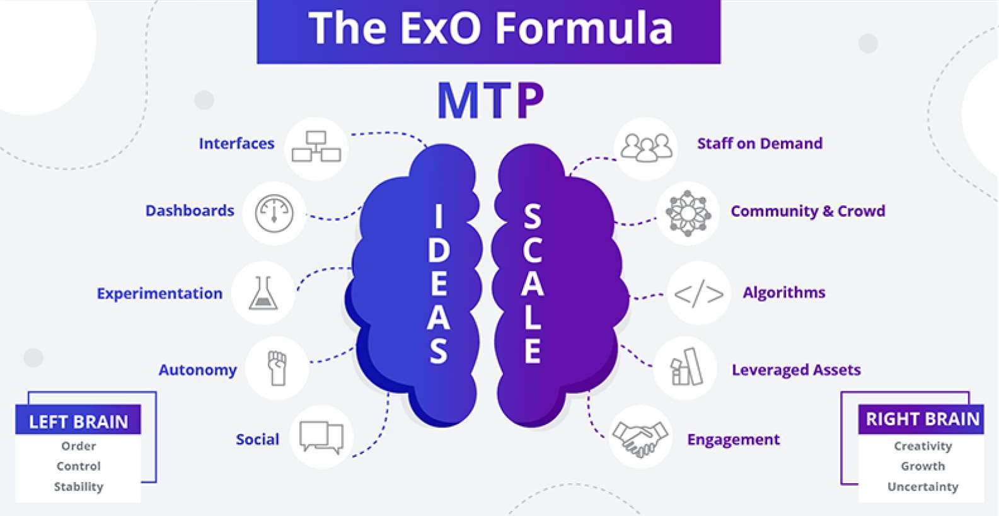

# 군더더기 없이 기하급수적으로 성장하는 스타트업 시작하기

## 군더더기 없는 스타트업 시작

### 1. 군더더기 없는?
군더더기 없는 스타트업이란, 불필요한 복잡성을 제거하고 핵심적인 부분에만 집중하여 효율적으로 운영되는 기업을 의미합니다. 이는 초기 자본과 자원이 제한된 스타트업에게 특히 중요합니다. 최소한의 자원으로 최대한의 가치를 창출하기 위해, 군더더기 없는 운영 방식은 필수적입니다.

### 2. 군더더기 없는 스타트업?
군더더기 없는 스타트업은 명확한 목표와 전략을 가지고, 고객의 요구에 집중하며, 빠르게 피드백을 받고 이에 대응합니다. 이 방식은 초기 시장 검증 및 제품 개발 단계에서 특히 유용하며, 불필요한 기능이나 복잡한 절차를 제거함으로써 개발 속도를 높이고 리소스를 절약할 수 있습니다.

### 3. 결론 - 모든 것이 부족해서 군더더기 없어야 한다
초기 스타트업은 자금, 인력, 시간 등 모든 것이 부족합니다. 따라서 불필요한 요소를 제거하고, 필수적인 부분에 집중하는 것이 성공의 열쇠입니다. 이러한 방식은 초기 생존뿐만 아니라 장기적인 성장에도 긍정적인 영향을 미칩니다.

## 기하급수적인 성장

### 1. 기하급수적인 성장
기하급수적인 성장은 일정한 비율로 계속해서 빠르게 증가하는 성장을 의미합니다.  
이는 일반적인 선형 성장과는 달리, 초기에는 느리게 시작하지만 시간이 지남에 따라 폭발적인 성장을 보입니다. 이를 두고 기하급수적인 성장의 '숨은 성장기(deceptive)'라고 합니다.  
전통적인 산업의 일반적인 선형 성장과 대비되는 기하급수적인 성장을 이루기 위해서는 혁신적인 비즈니스 모델, 강력한 네트워크 효과, 그리고 뛰어난 제품/서비스가 필요합니다.

### 2. OpenExO
OpenExO는 기하급수적으로 성장하는 조직(ExO, exponential organisation)을 달성하기 위한 프레임워크와 커뮤니티를 일컫습니다. OpenExO가 제공하는 프레임워크는 확장 가능한 기술과 전략을 통해 조직이 빠르게 성장할 수 있도록 돕습니다.  
아래에서 좀 더 구체적인 프레임워크를 살펴보도록 하겠습니다.  

#### 2.1 MTP (Massive Transformative Purpose)
MTP는 조직이 달성하고자 하는 대규모의 변혁적인 목적을 의미합니다. 이는 조직의 방향성을 제시하고, 모든 팀원이 같은 목표를 향해 나아가도록 합니다. MTP를 설정하면 조직의 비전과 미션이 명확해지고, 이를 중심으로 전략을 수립할 수 있습니다.

#### 2.2 SCALE
SCALE은 조직이 기하급수적으로 성장하기 위해 필요한 다섯 가지 요소를 말합니다:
- **S:** Staff on Demand (필요할 때마다 활용 가능한 인력)
  - 예: 프리랜서 플랫폼을 활용하여 프로젝트별로 전문가를 고용.
  - **GenAI 활용 또는 Power Platform 활용** 인공지능을 통해 필요 인력을 자동으로 추천받고, 인터뷰 과정을 자동화하여 시간과 비용 절약. 자동화된 작업 할당 및 추적 시스템 구축.

- **C:** Community & Crowd (커뮤니티와 대중)
  - 예: 고객 커뮤니티를 구축하여 제품 개발에 필요한 피드백을 얻음.
  - **GenAI 또는 Power Platform 활용:** 소셜 미디어 분석을 통해 고객의 요구와 트렌드를 파악. 커뮤니티 관리와 피드백 수집을 자동화하는 애플리케이션 개발.

- **A:** Algorithms (알고리즘)
  - 예: 데이터 분석 알고리즘을 통해 고객 행동 예측.
  - **GenAI 또는 Power Platform 활용:** 머신러닝 알고리즘을 사용하여 예측 모델을 개선. 데이터 분석 및 시각화 도구를 통해 인사이트 제공.

- **L:** Leveraged Assets (활용 가능한 자산)
  - 예: 기존 인프라와 기술을 최대한 활용하여 비용 절감.
  - **GenAI 또는 Power Platform 활용:** 로우코드 툴 또는 SaaS 서비스 등을 활용해 자산 관리 및 최적화 솔루션 사용하거나 시스템 구축.

- **E:** Engagement (참여)
  - 예: 고객 참여를 통해 제품 개선.
  - **GenAI 또는 Power Platform 활용:** 고객 참여 데이터 분석을 통해 맞춤형 마케팅 전략 수립. 고객 참여를 유도하는 앱과 대시보드 개발.

#### 2.3 IDEAS
IDEAS는 기하급수적 성장을 위한 다섯 가지 내부 요소를 의미합니다:
- **I:** Interfaces (인터페이스)
  - 예: 사용자 친화적인 인터페이스 개발.
  - **GenAI 활용:** 사용자 행동을 분석하여 최적의 UI/UX 디자인 제안.
  - **Power Platform 활용:** 사용자 피드백 기반으로 인터페이스를 지속적으로 개선.

- **D:** Dashboards (대시보드)
  - 예: 실시간 데이터 모니터링을 위한 대시보드 구축.
  - **GenAI 활용:** 데이터 분석을 통한 인사이트 제공.
  - **Power Platform 활용:** 커스터마이즈된 대시보드를 통해 실시간으로 KPI 추적.

- **E:** Experimentation (실험)
  - 예: A/B 테스트를 통해 제품 기능 개선.
  - **GenAI 활용:** 실험 결과를 분석하고 최적의 해결책 제안.
  - **Power Platform 활용:** 실험 계획 및 결과 추적 시스템 구축.

- **A:** Autonomy (자율성)
  - 예: 팀원들에게 자율성을 부여하여 창의적 해결책 도출.
  - **GenAI 활용:** 자율적 의사결정을 지원하는 인공지능 도구 제공.
  - **Power Platform 활용:** 팀원들의 자율적인 업무 관리 시스템 개발.

- **S:** Social Technologies (소셜 기술)
  - 예: 협업을 촉진하는 소셜 플랫폼 사용.
  - **GenAI 활용:** 협업 도구의 활용도를 분석하고 개선점 제안.
  - **Power Platform 활용:** 협업 플랫폼 통합 및 커뮤니케이션 자동화 도구 개발.

>참고: [https://web.openexo.com/learn-about-exo/](https://web.openexo.com/learn-about-exo/)
>OpenExO 프레임워크를 따른 대표적인 기업으로는 'Airbnb', 'Google', 'Tesla', 'Netflix' 등이 있습니다.
>ExO 프레임워크를 따르는 기업들
>>**Airbnb:**  
>>- **MTP:** 누구나 어디서든 소속감을 느낄 수 있는 세상을 만들기.
>>- **SCALE:** 커뮤니티와 대중을 활용하여 부동산 자산 없이 숙박 서비스를 제공.
>>
>>**Google:**  
>>- **MTP:** 세상의 정보를 조직화하여 누구나 접근 가능하고 유용하게 만들기.
>>- **IDEAS:** 실험과 자율성을 촉진하여 Gmail, Google Maps, 자율주행차 등 혁신을 이끌어냄.
>>
>>**Tesla:**  
>>- **MTP:** 세계의 지속 가능한 에너지로의 전환 가속화.
>>- **SCALE:** 기가팩토리에서 활용 가능한 자산을 사용하고 커뮤니티 참여를 통해 전기차 기술 발전.
>>
>>**Netflix:**  
>>- **MTP:** 세계를 즐겁게 하기.
>>- **IDEAS:** 새로운 콘텐츠 인터페이스 실험, 개인화된 추천을 위한 알고리즘 활용, 인터랙티브 기능과 소셜 미디어 통합을 통한 사회적 참여 촉진.

### 3. 체계적으로 조직하고 협업을 일상화하기
스타트업의 성공적인 성장을 위해서는 체계적인 조직과 효율적인 협업이 필수적입니다.  
모든 팀원이 같은 목표를 향해 나아가며, 정보 공유와 협력이 일상화된 조직은 빠르게 변화하는 시장 환경에 효과적으로 대응할 수 있습니다. 이는 또한 혁신을 촉진하고, 문제 해결 속도를 높이는 데 기여합니다.

### 4. 기술 시대 핵심은 사업의 본질
기술이 빠르게 발전하는 시대에, 성공적인 스타트업은 기술 자체보다는 기술을 활용한 사업의 본질에 집중해야 합니다. 고객이 원하는 가치를 제공하는 것이 가장 중요하며, 이를 위해 최신 기술을 적절히 활용하는 것이 필요합니다. 기술은 도구일 뿐, 본질은 고객에게 가치를 전달하는 것입니다.

## 생성형 인공지능과 로우코드로 군더더기 없는 스타트업 시작하고 기하급수적으로 성장시키기

### 1. 제 아무리 로우코드도 버겁다
로우코드 플랫폼은 프로그래밍 지식이 부족한 사람도 쉽게 애플리케이션을 개발할 수 있게 해줍니다. 하지만 실제로 스타트업이 직면하는 문제들은 단순하지 않으며, 로우코드 플랫폼만으로 모든 문제를 해결하기에는 한계가 있습니다. 기술적인 어려움뿐만 아니라, 시장 적응, 고객 피드백 반영 등의 과제가 남아 있습니다.

### 2. 생성형 인공지능으로 로우코드로 MVP 만들기
생성형 인공지능을 활용하면 로우코드 플랫폼의 한계를 극복하고, 보다 빠르고 효율적으로 MVP(최소 기능 제품)를 개발할 수 있습니다. AI는 복잡한 문제를 해결하고, 데이터 분석을 통해 인사이트를 제공하며, 자동화된 코딩을 통해 개발 속도를 높일 수 있습니다. 이를 통해 스타트업은 초기 시장 진입에 필요한 시간을 단축하고, 빠르게 피드백을 받아 제품을 개선할 수 있습니다.

### 3. GenAI와 Power Platform 활용
GenAI(생성형 인공지능)와 Power Platform을 활용하면 스타트업의 개발 및 운영 과정을 더욱 효율적으로 만들 수 있습니다. GenAI는 자연어 처리, 예측 분석, 자동화된 의사결정 지원 등 다양한 기능을 제공하여, 복잡한 업무를 간소화하고 생산성을 높입니다. Power Platform은 로우코드/노코드 개발 환경을 제공하여, 비즈니스 사용자도 쉽게 애플리케이션을 개발하고 데이터 분석을 수행할 수 있도록 합니다. 이 두 기술을 결합하면, 스타트업은 적은 자원으로도 고도화된 디지털 솔루션을 구축하고, 시장 변화에 빠르게 대응할 수 있습니다.

#### GenAI와 Power Platform 활용 예시
- **고객 지원 자동화:** GenAI를 사용하여 고객의 문의를 자동으로 처리하고, Power Platform을 통해 고객 지원 티켓을 관리.
- **마케팅 캠페인 최적화:** GenAI로 고객 데이터를 분석하여 타겟 마케팅 전략 수립, Power Platform을 사용하여 마케팅 캠페인 실행 및 결과 추적.
- **재고 관리 최적화:** GenAI를 통해 재고 예측 모델을 개발하고, Power Platform을 통해 재고 관리 시스템 구축 및 자동화.

## 실습에 앞서
실습을 시작하기 전에, 우리는 기하급수적인 성장을 위해 어떤 전략을 취할 것인지 명확히 해야 합니다. 또한, 사용할 도구와 기술에 대해 충분히 이해하고 있어야 합니다. 이 단계에서는 목표 설정, 리소스 확보, 팀 구성 등이 중요합니다. 준비가 완료되면, 실습을 통해 실제로 적용해 보면서 배우고 성장할 수 있습니다.
