# 01. Excel의 데이터를 사용하여 부동산 솔루션용 Power Apps 캔버스 앱 구축

이 모듈에서는 부동산 회사와 그 운영을 중심으로 하는 Microsoft Power Platform 솔루션 생성을 시작합니다. 첫 번째 단계는 부동산 중개인이 자산을 관리하는데 사용하는 Power Apps 캔버스 앱으로 시작하는 것입니다. 이 앱의 데이터는 Excel 파일에 저장되며 AI Copilot Excel to App 기능을 사용하여 앱을 만들 수 있습니다. 또한 Power Apps Ideas를 사용하여 수식 작성 환경을 생성하고 가속화하여 앱에 더 많은 기능을 추가하게 됩니다.

- 소개 : 2분
- 연습 – Excel 파일의 데이터로 캔버스 앱 만들기 : 30분

RealEstateProperties.xlsx 다운로드


# 1. 소개
2분

Microsoft Power Apps의 Copilot에서 Excel에서 앱으로 기능을 사용하면 Microsoft Excel 파일을 선택하고 앱을 만든 다음, 만든 앱을 실행할 수 있습니다. 귀하가 만드는 모든 앱에는 기록을 찾아보고, 기록 세부 정보를 표시하고, 기록을 생성 또는 업데이트할 수 있는 화면이 포함되어 있습니다. 앱을 생성하면 엑셀 데이터를 활용해 빠르게 작동하는 앱을 얻을 수 있습니다. 그런 다음 필요에 맞게 앱을 맞춤설정할 수 있습니다.

Excel 파일을 업로드하면 Microsoft Dataverse 테이블이 생성됩니다. Dataverse의 표준 및 맞춤 테이블을 사용하면 데이터를 클라우드에 더욱 안전하게 저장할 수 있습니다. 또한 이러한 테이블을 사용하여 비즈니스 요구 사항에 맞는 방식으로 조직의 데이터를 정의할 수 있으므로 앱 내에서 데이터를 더 쉽게 사용할 수 있습니다.

귀하의 환경이 미국 지역에 있고, 조직에서 AI가 활성화되어 있는 경우, Microsoft 365 Copilot은 업로드된 파일에 해당 정보가 누락된 경우에도 테이블 이름, 설명, 열 데이터 유형 및 헤더를 제안하여 테이블을 생성하는데 도움을 줄 수 있습니다. . 테이블 생성을 위해 Microsoft 365 Copilot을 사용하면 Copilot의 AI가 테이블을 생성했음을 나타내기 위해 Copilot 카드가 표시됩니다.

# 2. 연습 – Excel 파일의 데이터로 캔버스 앱 만들기
30 분

이 연습에서는 Excel 테이블의 데이터를 사용하여 모바일 애플리케이션을 만듭니다. 이 연습에 사용할 RealEstateProperties.xlsx를 다운로드하세요.


참고   
Microsoft Power Apps에는 Microsoft 365 라이선스 또는 무료 평가판이 필요합니다. 라이선스 옵션에 대해 자세히 알아보세요. Microsoft 제품에는 Power Apps 및 Power Automate가 포함됩니다.

1. make.powerapps.com 으로 이동하여, Power Apps 자격 증명으로 로그인합니다.

2. Power Apps 홈 화면에서 데이터로 시작을 선택합니다.
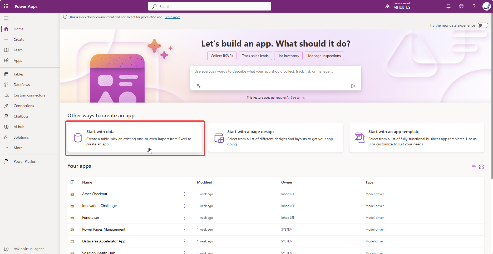

3. Excel 파일 업로드를 선택합니다.
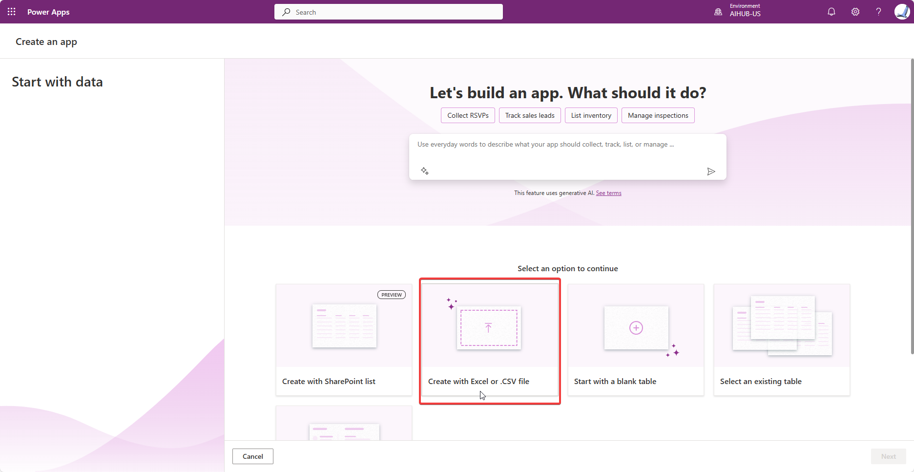

4. 장치에서 선택 옵션을 선택합니다. RealEstateProperties.xlsx Excel 파일을 저장한 위치로 이동 한 후 업로드하세요. (최대 파일 크기 제한은 5GB입니다.)
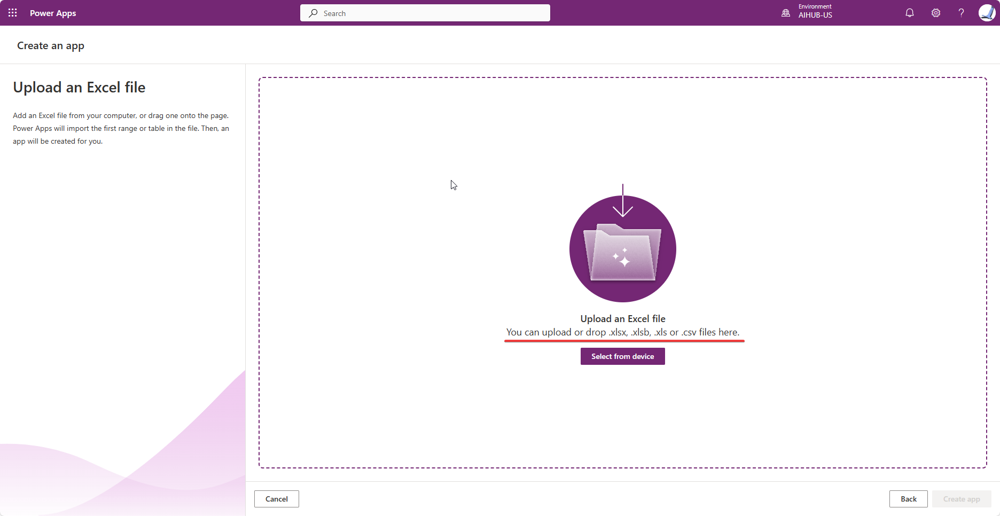

5. Power Apps는 RealEstateProperties.xlsx Excel 파일의 데이터를 기반으로 하는 테이블을 생성합니다. Power Apps가 어떻게 부동산 자산 으로 이름을 지정 하고, 7개의 데이터 열을 정의했는지 확인하세요.

6. 화면 오른쪽 하단에 있는 앱 만들기 버튼을 선택합니다.
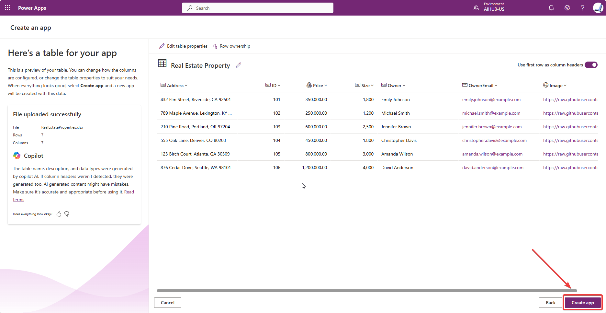

7. 앱이 처음 로드되면 Power Apps Studio에 오신 것을 환영합니다 라는 대화 상자가 나타날 수 있습니다. 그렇다면 건너뛰기 버튼을 선택하세요.
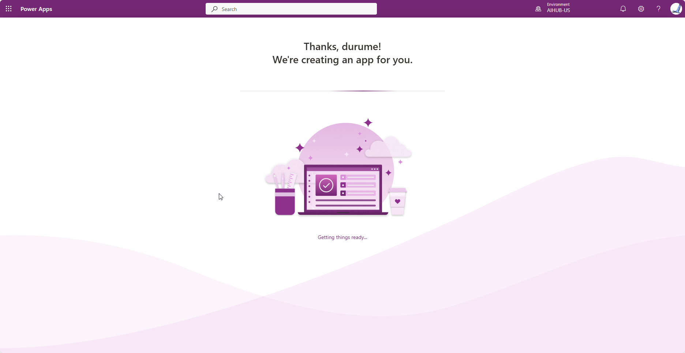

​생성된 앱은 편집 모드로 표시되어야 합니다.

9. 왼쪽 탐색 모음에서 데이터 아이콘을 선택합니다. Dataverse 테이블은 RealEstateProperties.xlsx Excel 파일을 기반으로 생성됩니다.

10. 트리 보기로 돌아가려면 트리 보기 아이콘을 선택합니다 .

11. 앱의 메인 화면에서 부동산 세부 정보가 표시되는 갤러리를 선택한 다음, 트리 보기에서 RecordsGallery1을 선택하여 확장합니다.

12. NextArrow 옵션 옆에 있는 줄임표( ... )를 선택한 다음 삭제합니다.

13. RecordsGallery1을 선택한 다음 편집 버튼을 선택하여, 갤러리를 편집 모드로 전환합니다.

14. 너비를 줄이고, 제목 구성 요소 의 위치를 이동하여 템플릿 셀의 오른쪽을 향하도록 합니다.

다른 구성 요소는 제목 구성 요소와 함께 위치를 변경해야 합니다. 그렇지 않은 경우 이전 스크린샷과 유사할 때까지 이동합니다.

14. 갤러리가 아직 편집 모드에 있는지 확인하세요. 제목을 선택합니다 .

​15. 제목 구성 요소 의 텍스트 값 이 다음 수식으로 설정되어 있는지 확인합니다 .

​ThisItem.Address

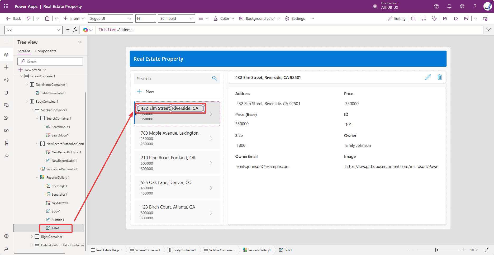

16. 갤러리에서 부제목 구성 요소를 선택합니다 .

​17. 부제목 의 텍스트 값을 다음 수식으로 설정합니다 .

​ThisItem.Size

​18. 페이지 상단의 툴바를 사용하여 크기를 13 으로 변경합니다.
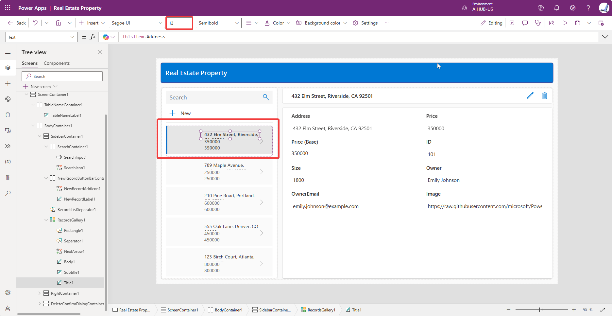

19. 갤러리에서 Body 구성 요소를 선택합니다 .

​20. 본문 의 텍스트 값을 다음 수식으로 설정합니다 .

​ThisItem.Price

이제 갤러리는 다음 스크린샷과 유사해야 합니다.

21. RecordsGallery1 의 첫 번째 항목을 선택한 상태에서, Insert 를 선택하고 Image 를 검색한 다음, Image 구성 요소를 선택합니다. 그러면 갤러리에 이미지가 추가됩니다.
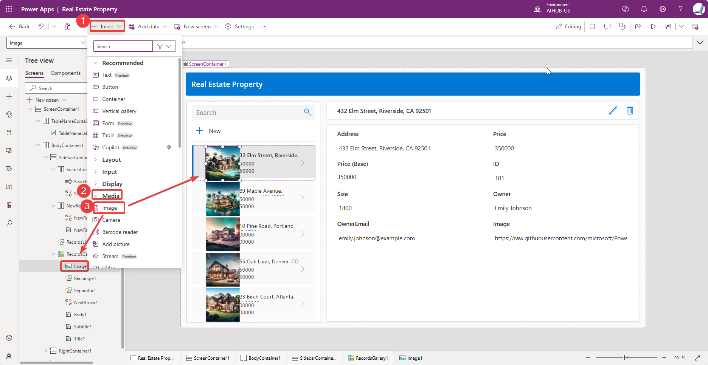

22. 이미지가 갤러리에 추가된 것으로 표시되어야 합니다. 이미지가 각 갤러리 셀의 중앙에 오도록 위치를 변경하고 크기를 조정합니다.

23. Microsoft Power Apps Ideas를 사용하려면 갤러리가 여전히 편집 모드에 있는지 확인하세요. 가격이 포함된 갤러리 본문을 선택합니다. 가격 구성 요소 위에 나타나는 코파일럿 아이콘 옆에 있는 화살표를 선택합니다. 텍스트 서식을 선택합니다 .

24. 원하는 형식 에 다음 값을 입력 하고, 키보드에서 ```Enter``` 키를 누릅니다.

​$350,000

​25. 생성된 수식을 선택한 다음, ```적용``` 을 선택합니다 .

​참고   
Copilot의 도움을 받아 입력한 예제($350,000) 값은 다음 수식을 생성했으며, 이제 가격 갤러리 컨트롤의 수식 입력줄에 표시됩니다.

​(Text(ThisItem.Price, "$#,##0", "en-US"))
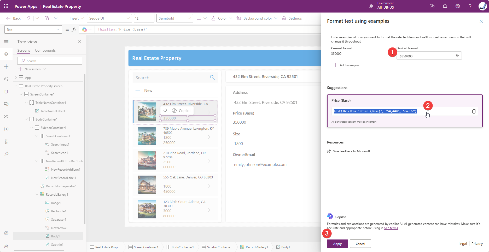
​
26. 갤러리 부제목의 크기 컨트롤 에 대해 동일한 단계를 완료합니다. 갤러리가 편집 모드인지 확인하세요. 크기가 포함된 부제목을 선택하세요. 크기 구성 요소 위에 나타나는 Copilot 아이콘 옆에 있는 화살표를 선택합니다. 텍스트 서식을 선택합니다 .

원하는 형식 에 다음 값을 입력합니다 .

Size: 1,800 sq ft

키보드의 Enter 키를 누르세요 .

아이디어 섹션이 비어 있음을 알 수 있습니다. 원인은 수식을 생성하는데 필요한 정보나 컨텍스트가 부족하기 때문일 수 있습니다.

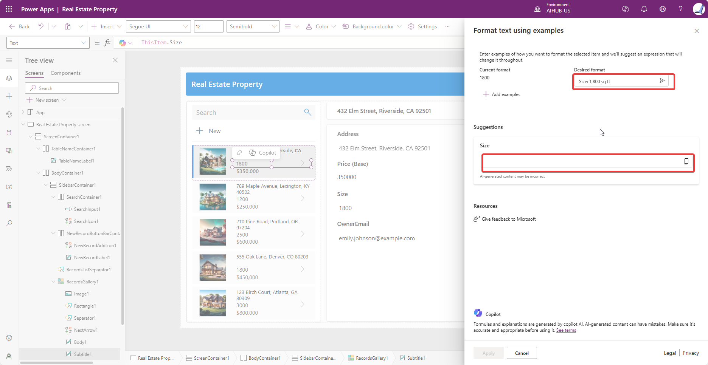
28. 아이디어 섹션이 비어 있으므로 더 많은 예시를 추가하게 됩니다. ```+ 예제 추가```를 두 번 이상 선택하세요 .

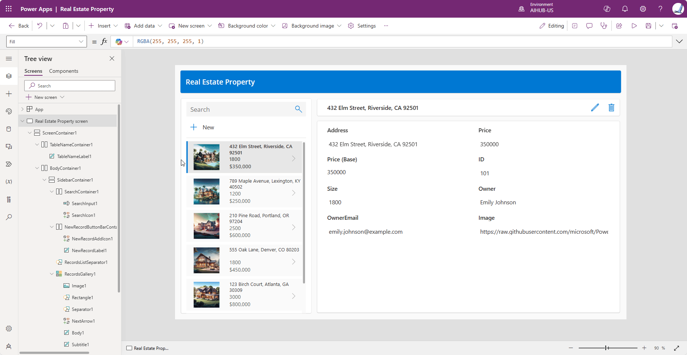

​29. 현재 형식 두 개를 선택한 다음 해당하는 원하는 형식 두 개를 제공하세요.

30. 추가된 컨텍스트를 통해 Power Apps Ideas는 다음 이미지와 같이 적합한 수식을 생성합니다.

​31. 생성된 수식을 선택한 다음 ```적용```을 선택합니다 .

갤러리는 다음 이미지와 유사해야 합니다.

32. 앱을 저장합니다 .

​33. 앱을 종료 하여 Power Apps 홈 페이지로 돌아갑니다.
