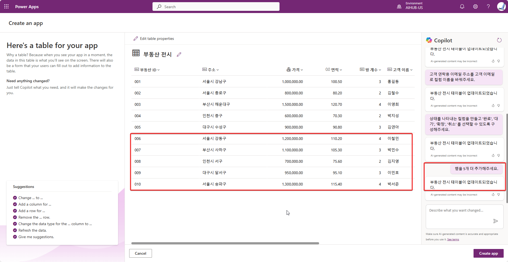
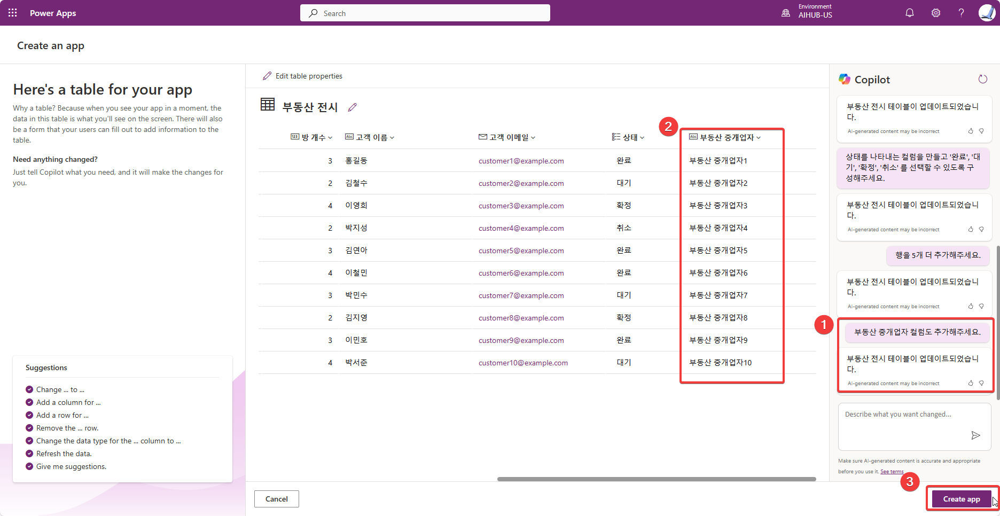
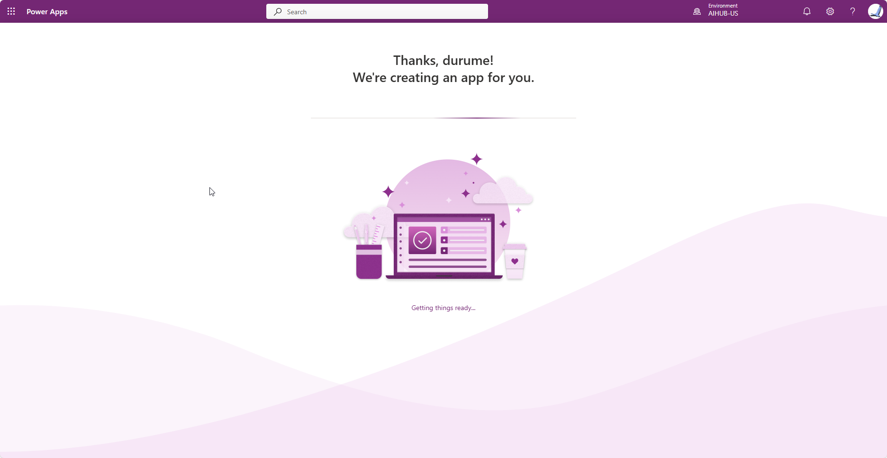
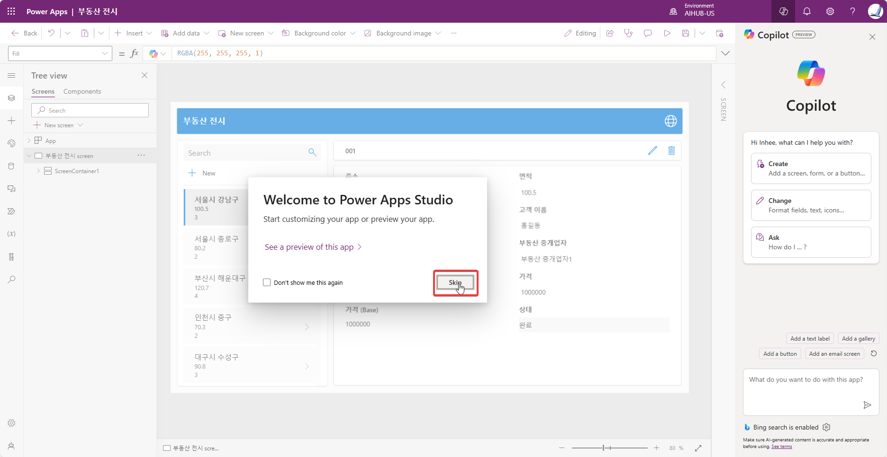
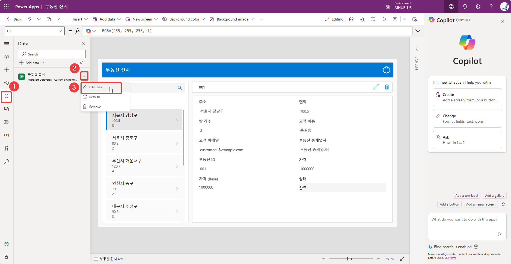
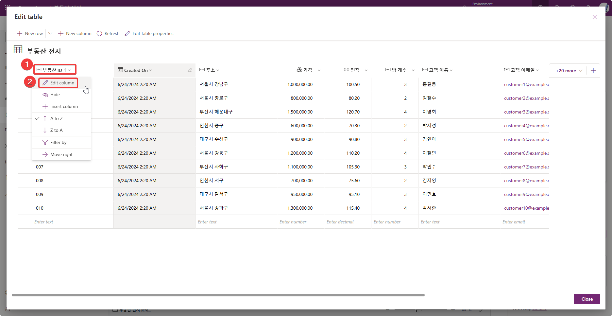
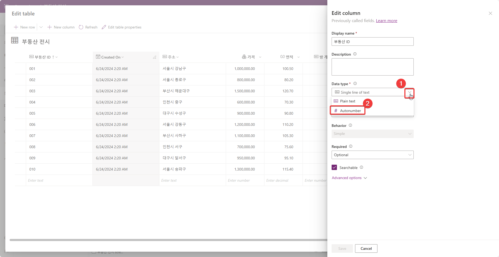
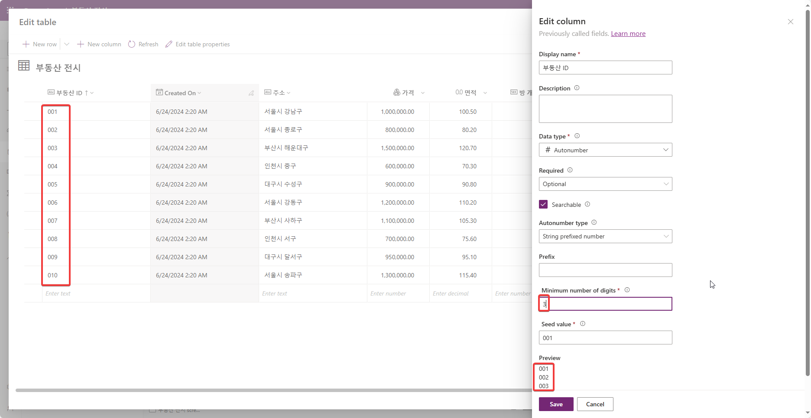
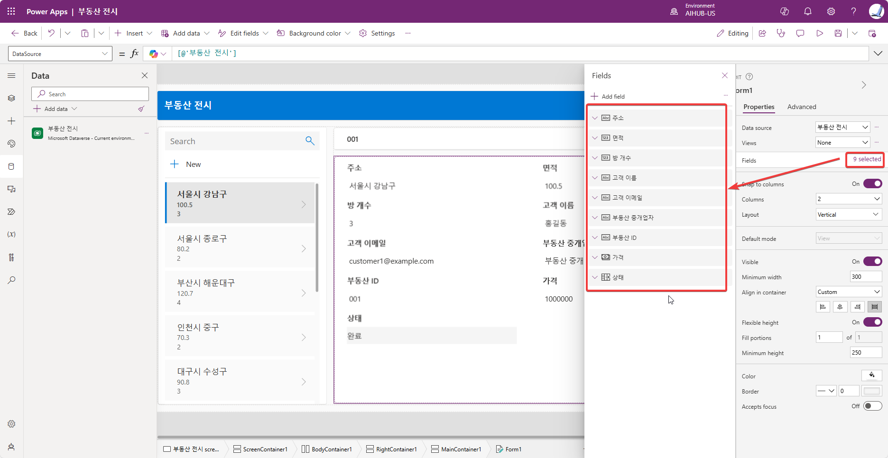
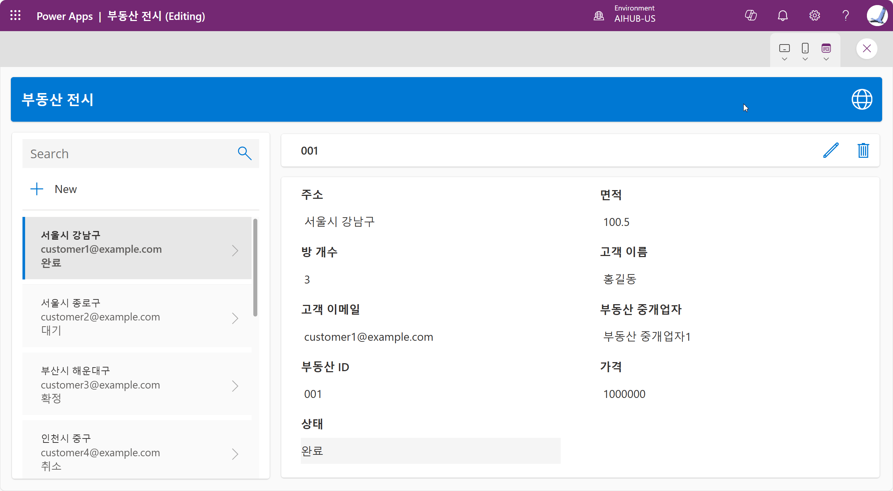

*https://learn.microsoft.com/en-us/training/modules/build-canvas-app-real-estate-power-apps-copilot/exercise 자료를 활용해서 한국어 자료 만들기*
# 파워앱스에서 코파일럿으로 캔버스 앱 만들기

## 프롬프트 사용하기
코파일럿은 마이크로소프트가 제공하는 생성형 인공지능 서비스입니다. 다양한 코파일럿이 있으며, 파워앱스에서는 코파일럿을 사용하여 캔버스 앱을 만들 수 있습니다. 코파일럿은 사용자에게 질문을 하고 사용자의 답변을 기반으로 앱을 만들 수 있습니다. 코파일럿은 사용자가 앱을 만들 때 사용할 수 있는 데이터를 제공하고, 사용자가 앱을 만들 때 사용할 수 있는 기능을 제안할 수 있습니다.  

먼저 [https://make.powerapps.com](https://make.powerapps.com)에 로그인하고 새 앱을 만들어 보겠습니다.  

```prompt

부동산 전시를 위한 관리용 앱을 만들어 봅시다
```

  

보시는 것처럼 한글로 프롬프트에 입력해도 잘 작동하네요.  
과거에는 한글로 프롬프트에 입력하면, 생성형 인공지능의 특성상 동일한 결과를 얻지 못하는 경우가 많이 있었습니다. 하지만, 이번에 GPT가 성능이 업데이트를 통해서 개선되면서 같은 프롬프트를 입력하였는데 결과가 같게 나오네요.  

아래와 같이 결과가 나옵니다.  
  

새로 동일한 프롬프트를 입력했는데도 결과값은 같습니다. 더 이상 "생성형 인공지능이 제공하는 코드는 일관성이 없어서 못쓴다"는 이야기는 설득력이 점점 잃어가지 않을까 싶습니다.  
  

## 생성할 앱의 데이터베이스용 테이블 편집하기
앱은 기본적으로 데이터를 생성(create)하고, 읽어오고(read), 수정 또는 업데이트하고(update), 삭제(delete)하는 일을 수행합니다. 따라서 앱은 데이터를 저장할 것이 필요한데, 테이블이 가장 일반적이고 효율적입니다.  
아래 보시는 것처럼 기본적으로 제안한 테이블은 만드려는 앱에 필요한 요소가 누락되기도 합니다. 그런 누락되거나 수정해야 할 요소들을 코파일럿을 활용해서 처리하면 한결 수월합니다.  

1. 고객 확인용 이메일 컬럼을 채팅을 통해서 추가  
  

2. 고객 확인용 이메일 컬럼의 제목 변경요청  
  

3. '상태'라는 선택(Choice) 형태의 컬럼 추가 요청  
어떤 값들을 선택하게 할 것인지 미리 알려주면 알아서 구성  
```prompt
상태를 나타내는 컬럼을 만들고 '완료', '대기', '확정', '취소'를 선택할 수 있도록 구성해주세요.
```
  

4. 행을 다섯개 더 추가하고 값을 채우게 지시  
  

5. 부동산 중개업자 컬럼 추가 요청  


테이블 구성 및 편집을 마치고 나서 앱 만들기를 시작합니다. 
아래와 같은 화면이 나오고 앱을 클라우드 어딘가에 배치하기 시작하죠.  
  

## 앱 스튜디오에서 앱 만들기
앱 스튜디오에 들어서면 안내가 나오는데, 크게 관계 없으니 우리는 팝업 창을 지우고 ```건너뛰기(Skip)```를 통해 곧바로 앱 편집으로 접어들겠습니다.  


### 1. 테이블 편집
앱을 만들기 전에 테이블 초안 작업을 하였다면, 앱 만들기를 시작하는 순간 **Dataverse**에 해당 앱을 위한 테이블이 만들어 집니다(사례에서는 ```부동산 전시``라는 테이블이 생성).  

#### 편집할 테이블 선택 후 편집 시작
1. 왼편 메뉴에서 '데이터(Data)' 아이콘을 눌러 테이블 편집을 시작합니다.  
2. 해당 테이블 이름 옆에 있는 말줄임표(...)를 누릅니다.  
3. 데이터 편집(Edit data)를 눌러 테이블을 편집합니다.  



#### ID 컬럼의 편집
ID 컬럼은 고유한 값을 가져야 하므로 순차적으로 값을 부여하기 위해 컬럼의 속성을 바꿔줍니다.  


데이터 타입을 자동으로 번호를 생성해주는 ```Autonumber```로 바꿔줍니다.  
  

상세 내역은 왼쪽의 세자리 숫자인 원래 데이터를 고려해서 세자리 수로 정하고, 미리보기(Preview)를 통해 문제가 있는 지 확인합니다.  


### 2. 앱 화면 구성
미리 만들어 둔 컴포넌트인 '갤러리(gallery)'에 반영된 모양을 정리하고, 나타낼 값들을 확인한 후에 원하는 값만 앱에서 전시되게 합니다.


### 3. 반응형 앱 확인하기
코파일럿을 활용해서 앱을 만들면 기본적으로 태블릿용 앱이 만들어지는데, 반응형 앱입니다.  

