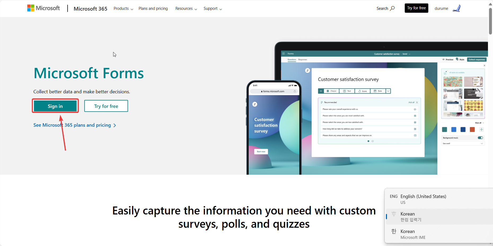
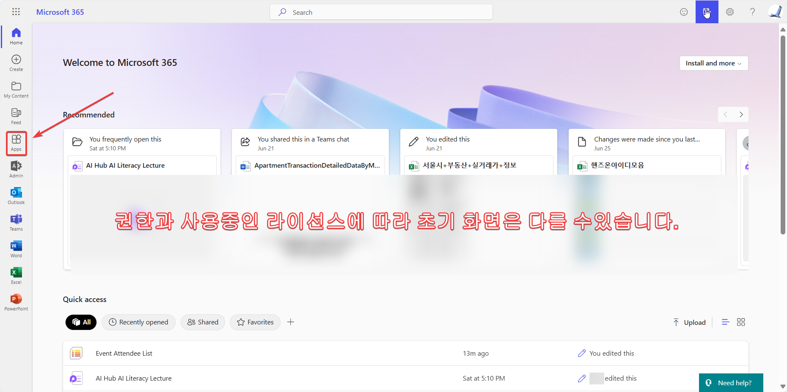
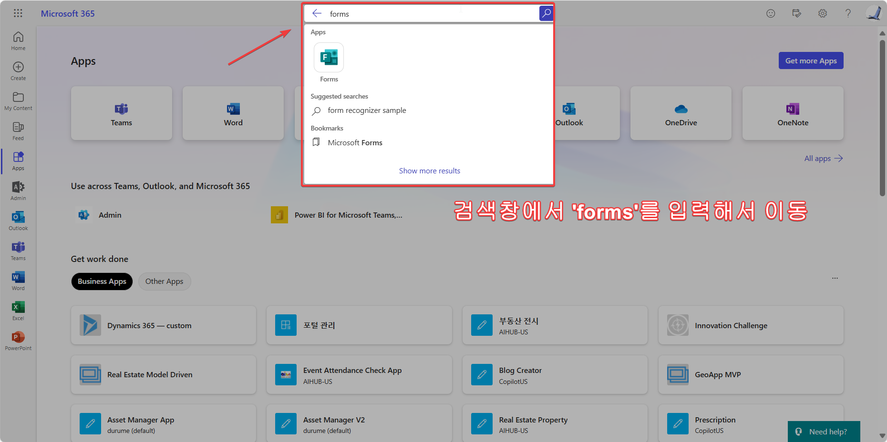
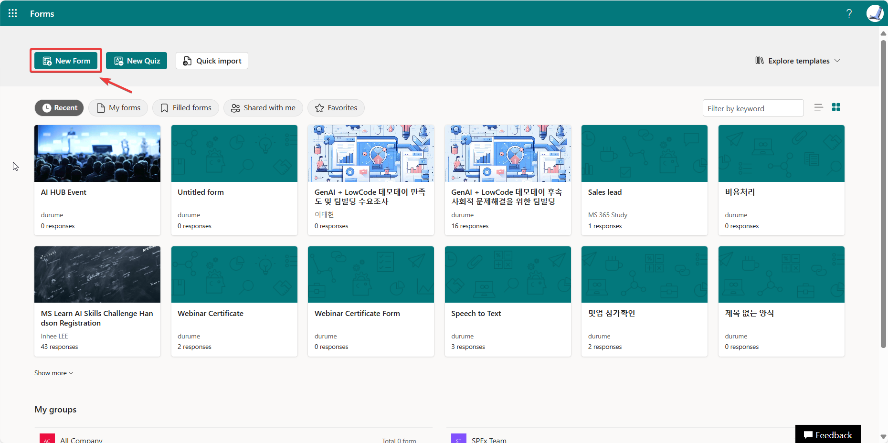
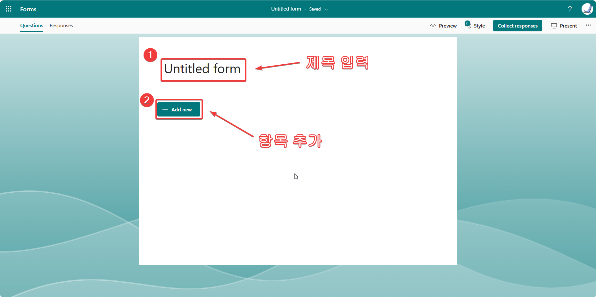

# 마이크로소프트 폼즈(MS Forms) 활용 신청받기

## 마이크로소프트 폼즈 사용법 기초

### 1. MS Forms 로그인
[https://forms.microsoft.com](https://forms.microsoft.com)로 이동해서 로그인 합니다. 또는 [https://forms.office.com](https://forms.office.com)으로 이동해도 같습니다.  

>물론 [office.com](https://office.com)에서 로그인한 다음 이동해도 됩니다.  
>
>  
>
>

### 2. 새 양식(New Form) 만들기
로그인후 아래와 같은 화면을 보시게 되는데, 'New Form(또는 새 양식)'을 선택합니다.

#### 1. 제목 입력
새로 생긴 양식(Form)에 제목을 입력합니다. 제목은 해당 폼을 찾는 기준이 되므로 나중에 찾기 쉽게 직관적으로 짓는 것이 좋습니다.  
>제목은 나중에 Power Automate에서 업무를 자동화할 때 자주 찾게 됩니다. 경험상 영어가 찾기 쉽고 오류가 적었습니다만 최근 기술의 발전으로 한글도 잘 인식하는 듯 합니다.  

