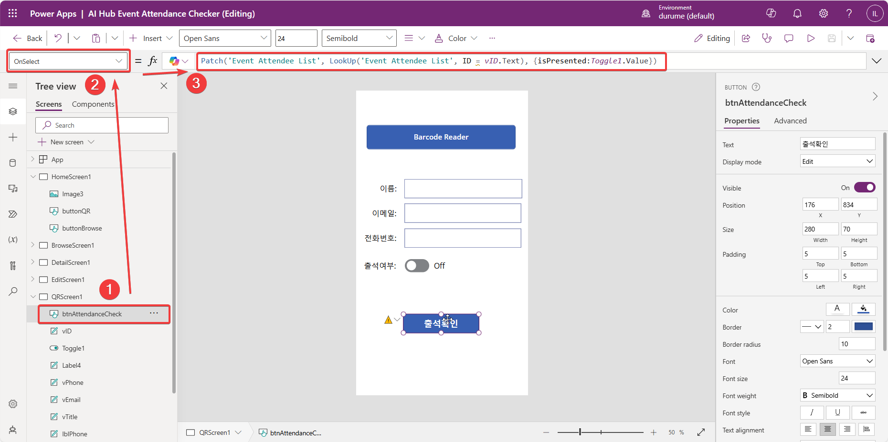

# 파워앱스(Power Apps)로 쉽게 앱 만들기

## 1. 쉐어포인트 목록(SharePoint List)에서 클릭 한번에 모바일 앱만들기
** 이 과정은 쉐어포인트에 대한 내용이라기 보다 쉐어포인트 목록에서 손쉽게 앱을 만드는 것을 설명하기 위한 것으로 쉐어포인트에 대한 내용은 다른 곳에서 설명하기로 합니다.  

### 1. 앱 만들 쉐어포인트 목록으로 이동
앱을 만드려는 쉐어포인트 목록으로 이동합니다.


### 2. 클릭 한 번으로 모바일 앱 만들기
해당 목록 상단에 메뉴들이 보이는데,  
- 그 가운데 'Integrate'이라는 부분을 펼쳐서(아래 이미지의 '1'번),  
- Power Apps를 다시 펼치고(아래 이미지의 '2'번),  
- 다시 'Create an app'을 누르면(아래 이미지의 '3'번) 해당 목록을 활용한 기본적인 앱을 생성해줍니다.  

앱 만들기가 이렇게 쉬울 수 있을까요?
>기본앱은 데이터를 처리할 수 있는 핵심요소인 데이터 생성(Create), 열람(Read), 수정(Update), 삭제(Delete)를 할 수 있는 기본 요소를 제공한다는 뜻입니다. 이를 두고 영어 머릿글자를 따서 'CRUD'라고 하고, 모든 앱의 기본활동을 제공합니다.  


>쉐어포인트 목록에서 클릭으로 기본 앱 만들기 전체과정 동영상보기 (아래 이미지 클릭)
>[](https://www.youtube.com/watch?v=9bp_hYfgsEQ)

### 3. 생성한 모바일 앱 편집하기
이 앱을 기초로 새로 스크린을 두 개 정도 추가해보도록 하겠습니다.  
홈으로 사용할 스크린과 QR 코드 확인용 스크린입니다.  
추가한 두 개의 스크린을 각각 'HomeScreen1'과 'QRScreen1'으로 바꿔줍니다. 이 때 이름은 기억하기 쉽게 하셔도 됩니다.  

그런 다음 'HomeScreen1'을 맨 위로 올려보냅니다.

>스크린 추가, 이름변경 및 이동 전체 다시 보기
>

### 4. 앱 중간 저장
온라인에서 작업하고 있으므로 중간 저장을 해둘 필요가 있습니다.  
오른쪽 상단의 저장(Save) 버튼을 울러서 저장을 실행합니다.  
  

팝업창에서 '앱 이름(사례에서는 "AI Hub Event Attendance Checker")'을 입력하고 저장합니다.  
  

저장한 이름으로 바뀐 것을 왼편 상단에서 확인하실 수 있습니다.  


### 5. HomeScreen1 꾸미기
앱의 첫화면인 'HomeScreen1'을 꾸며보겠습니다.  
스크린 순서가 제일 위에 있는 것이 첫 화면이 되는데 우리는 첫 화면에 로고를 넣고 버튼을 두 개 넣어 하나는 쉐어포인트 목록의 전체 데이터를 불러오는 화면인 'BrowseScreen1'으로 이동하게 하고, 나머지 하나는 새로 만든 'QRScreen1'으로 이동하게 하겠습니다.  

'Navigate'라는 명령을 각 버튼의 'OnSelect' 모드에서 실행할 수 있게 하면 됩니다.  

#### 1. 코파일럿 활용 버튼넣기
버튼 넣는 간단한 작업은 '코파일럿(Copilot)'에게 시켜 보겠습니다.  
먼저 오른쪽 상단에 있는 코파일럿 버튼을 눌러서 코파일럿을 실행해줍니다.  
  

다음으로 코파일럿에게 프롬프트를 통해 버튼을 추가하고 해당 버튼으로 각 스크린으로 이동할 수 있는 기능을 추가해달라고 합니다.  
```power apps
add 2 buttons to HomeScreen1 in order to navigate to BrowseScreen1 and QRScreen1 each
```
위 프롬프트를 입력하고 실행해볼까요?  
결과가 아주 잘 나오네요.  
버튼의 'OnSelect' 모드가 'Navigate(QRScreen1)'으로 되어 있는 걸 확인하실 수 있습니다.  
  

적절한 위치로 버튼일 이동시킨 후 표시 이름을 바꿔줍니다.  
표시 이름은 버튼을 더블클릭하거나 오른편의 편집창에서 바꿀 수 있습니다.  
  

#### 2. 로고 이미지 올리기
왼편 메뉴에서 'Media'를 누른 다음 'Add media'를 눌러 추가할 이미지 파일을 업로드 합니다.  


그런 다음 업로드한 로고를 끌어서 'HomeScreen1'의 빈곳에 적당히 위치시킵니다.  
  

### 6. QRScreen1 꾸미기
'QRScreen1'은 QR 코드를 확인하는 화면으로 만들어 보겠습니다.  
QR 코드를 확인하는 화면은 QR 코드를 스캔하고 확인하는 화면이므로,
- 화면에 Barcode Reader를 넣고,
- QR 코드를 스캔하는 기능을 넣어보겠습니다.
- QR 코드를 스캔하면 해당 QR 코드에 해당하는 데이터를 보여주는 기능을 넣어보겠습니다.
- 그리고 출석한 사람의 이름으로 출석을 확인하는 기능을 넣어보겠습니다.

#### 1. Barcode Reader 넣기
Barcode Reader는 'Media'에서 찾아 추가할 수 있습니다.  
  

Barcode Reader를 추가하고 난 후, 전면 카메라를 우선 사용하도록 바꿔줍니다. 후면 카메라 사용이 우선이기 때문입니다. 필요에 따라서는 이 부분은 생략하셔도 됩니다.  
왼쪽 상단에서 아래 이미지와 같이 'PreferFrontCamera'를 'true'로 바꿔주시면 됩니다.  
  

#### 2. Barcode Reader 설정
앞서 설정한 'Property'에서 'OnScan'을 선택하고 'OnScan' 모드에서 아래 코드를 입력합니다. 바코드가 너무 커서 좀 줄여야 할 듯 하네요.  

```power apps
Set(
    scannedData,
    First(BarcodeReader1.Barcodes).Value
);
Set(
    scannedTitle,
    First(Split(scannedData, "|")).Value
);
ClearCollect(
    scannedRecord,
    Filter(
        'Event Attendee List',
        Title = scannedTitle
    )
);
```
위 코드는 바코드를 스캔하면 해당 바코드에 해당하는 데이터를 'scannedData'에 저장하고, 다시 그 데이터를 '|'로 나누어서 처음에 위치한 이름(Title)을 'scannedTitle'에 저장합니다. 그리고 'Event Attendee List'에서 'scannedTitle'에 해당하는 데이터를 'scannedRecord'라는 Collection에 임시로 저장합니다.

  

'scannedRecord'라는 Collection은 왼쪽 변수(Variable)에서 확인하실 수 있습니다.  
  

#### 3. 스캔한 데이터 보여주기
스캔한 데이터를 화면에 보여주기 위해서 'scannedRecord' Collection을 이용하여 화면에 보여주는 기능을 넣어보겠습니다. 참고로 'scannedRecord' Collection은 'Title', 'Email', 'Phone'이라는 필드를 가지고 있습니다. 또한 오류를 체크하는 기능은 넣지 않았으므로, 이 부분은 생략하셔도 됩니다.  

'scannedRecord' Collection의 'Title', 'Email', 'Phone'을 보여주는 Label을 각각 넣습니다.  한꺼번에 실행하기 위해서 코파일럿을 사용하겠습니다. 프롬프트는 아래와 같이 작성했습니다.  

```prompt
Add 3 textlabels to QRScreen1 in order to show Title, Email, Phone from a linked sharepoint list.
```
  

추가한 TextLabel을 각각 'lblTitle', 'lblEmail', 'lblPhone'으로 바꿔주고 위치를 옮겨줍니다.  추가로 해당 Label 들의 값을 보여줄 Textlabel을 3개 더 추가하고, 각각 'vTitle', 'vEmail', 'vPhone'으로 바꿔주고 위치를 옮겨줍니다.  

- 'vTitle'은 'Text' 속성(Property)를 ```scannedTitle```로 바꿔주고,
- 'vEmail'은 'Text' 속성(Property)를 ```First(scannedRecord).email```로 바꿔주고,
- 'vPhone'은 'Text' 속성(Property)를 ```First(scannedRecord).phone```으로 바꿔주면 됩니다.  

  

#### 4. 출석여부 확인하기
다음으로 출석여부를 확인하는 'isPresented'라는 컬럼의 값을 가져와서 출석여부를 확인하는 Toggle을 추가하도록 하겠습니다.  

위 'Title', 'Email', 'Phone' Label 아래에 Toggle을 추가하고, 'Default' 속성(Property)을 ```First(scannedRecord).isPresented```로 바꿔주면 됩니다. 토글이 어떤 내용인지 모를 수 있으니, 토급 앞에 '출석여부'라는 Label을 추가하도록 하겠습니다.  

  

#### 5. 참석자 확인용 ID 추가
쉐어포인트 목록(SharePoint List)는 자동으로 보이지 않는 ID 컬럼을 생성해줍니다.  

참석자 이름이 같을 경우 문제가 될 수 있으니 우리는 쉐어포인트 목록의 ID를 활용하려고 합니다. ID 컬럼을 확인하는 방법은 쉐어포인트 목록의 설정에서 가능한데, 기회가 닿으면 따로 설명을 하도록 하겠습니다.  

참석자 확인용 ID를 가져올 TextLabel을 추가하고, 이름을 'vID'라고 바꿔보겠습니다.  
그리고 ```Text``` 속성을 ```First(scannedRecord).ID```로 바꿔주면 해당 값을 불러옵니다. 이 부분을 굳이 드러내고 싶지 않으시다면 ```DisplayMode```를 ```Disabled```로 바꿔주시면 됩니다.

  

#### 6. QR 코드 소지인 ID로 출석상태 업데이트
이제 이름이 같아서 혹시나 생길 오류를 해결하기 위해서 ```vID```에 해당 참가자의 ID 값을 표시했으므로 해당 값을 기초로 참가자의 출석상태를 변경해주면 됩니다.  

아래 그림과 같이 ```Button```을 추가하고 ```출석확인```으로 표시 이름을 바꾼 뒤에 다시 버튼명칭을 ```btnAttendanceCheck```로 바꿔줍니다.  


해당 버튼의 ```OnSelect``` 속성에 있는 함수를 아래와 같이 업데이트 해줍니다.  

```power apps
Patch('Event Attendee List', LookUp('Event Attendee List', ID = vID.Text), {isPresented:Toggle1.Value})
```

  

```Patch```라는 함수를 사용해서 ```vID```에 있는 ```Text``` 값으로 해당하는 사람에 대한 정보를 찾아오면 되는데 ```LookUp```이라는 함수를 사용합니다. 그리고 해당 참가자의 ```isPresented``` 컬럼의 값을 앱에 있는 값으로 업데이트 하겠다는 뜻입니다.  

```출석확인``` 버튼 앞에 노란색 주의 표시가 있는데, 스캔하면 값을 불러 오므로 해당 부분은 경고일 뿐이니 염려하지 않으셔도 됩니다.

#### 7. 신청자 명단으로 이동하는 버튼 추가
혹시 QR 코드를 가져오지 않았거나 찾지 못하는 분들의 출석확인이 필요할 수 있습니다. 그럴 경우 신청자 명단이 있는 ```BrowseScreen1```으로 이동해서 신청자 이름을 확인한 다음 상세 스크린인 ```DetailScreen1```으로 이동한 다음 ```EditScreen1```에서 상태를 변경할 수 있습니다.  

```Icon```을 하나 추가한 다음 ```Navigate(BrowseScreen1)``` 함수를 사용하면 쉽게 처리가 가능합니다. 그러기 위해서 우선 헤더에 해당하는 요소를 BrowseScreen1에서 복사해온 다음 붙여넣고 아이콘을 추가한 다음 색깔을 흰색으로 바꿔보겠습니다.  

]  

아이콘에 ```Navigate(BrowseScreen1)``` 이란 함수를 ```OnSelct```에 추가하는 걸 잊지 않으시기 바랍니다.

### 7. 저장 및 배포(Publish)
앱이 완성되었으니 저장하고 배포하면 됩니다.  


### 8. 실행하기
해당 앱을 실행하려면 [모바일용 파워앱스 앱](https://powerapps.microsoft.com/ko-kr/downloads/)을 내려받으셔야 합니다.  

직접 내려받으시려면 안드로이드 폰은 [Power Apps - Apps on Google Play](https://play.google.com/store/apps/details?id=com.microsoft.msapps&hl=en)에서, 아이폰은 [Power Apps on the App Store](https://apps.apple.com/us/app/power-apps/id1047318566)으로 이동하셔서 내려받으시면 됩니다.  

'Power Apps'를 내려받고 해당 앱을 실행할 아이디로 로그인하시면 배포하신 앱을 찾아서 실행하실 수 있습니다.  

