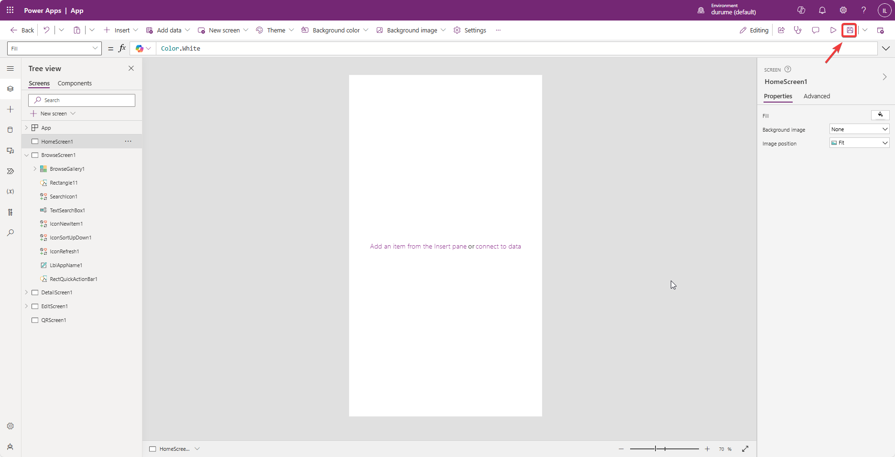

# 파워앱스(Power Apps)로 쉽게 앱 만들기

## 1. 쉐어포인트 목록(SharePoint List)에서 클릭 한번에 모바일 앱만들기
** 이 과정은 쉐어포인트에 대한 내용이라기 보다 쉐어포인트 목록에서 손쉽게 앱을 만드는 것을 설명하기 위한 것으로 쉐어포인트에 대한 내용은 다른 곳에서 설명하기로 합니다.  

### 1. 앱 만들 쉐어포인트 목록으로 이동
앱을 만드려는 쉐어포인트 목록으로 이동합니다.


### 2. 클릭 한 번으로 모바일 앱 만들기
해당 목록 상단에 메뉴들이 보이는데,  
- 그 가운데 'Integrate'이라는 부분을 펼쳐서(아래 이미지의 '1'번),  
- Power Apps를 다시 펼치고(아래 이미지의 '2'번),  
- 다시 'Create an app'을 누르면(아래 이미지의 '3'번) 해당 목록을 활용한 기본적인 앱을 생성해줍니다.  

앱 만들기가 이렇게 쉬울 수 있을까요?
>기본앱은 데이터를 처리할 수 있는 핵심요소인 데이터 생성(Create), 열람(Read), 수정(Update), 삭제(Delete)를 할 수 있는 기본 요소를 제공한다는 뜻입니다. 이를 두고 영어 머릿글자를 따서 'CRUD'라고 하고, 모든 앱의 기본활동을 제공합니다.  


>쉐어포인트 목록에서 클릭으로 기본 앱 만들기 전체과정 동영상보기 (아래 이미지 클릭)
>[](https://www.youtube.com/watch?v=9bp_hYfgsEQ)

### 3. 생성한 모바일 앱 편집하기
이 앱을 기초로 새로 스크린을 두 개 정도 추가해보도록 하겠습니다.  
홈으로 사용할 스크린과 QR 코드 확인용 스크린입니다.  
추가한 두 개의 스크린을 각각 'HomeScreen1'과 'QRScreen1'으로 바꿔줍니다. 이 때 이름은 기억하기 쉽게 하셔도 됩니다.  

그런 다음 'HomeScreen1'을 맨 위로 올려보냅니다.

>스크린 추가, 이름변경 및 이동 전체 다시 보기
>

### 4. 앱 중간 저장
온라인에서 작업하고 있으므로 중간 저장을 해둘 필요가 있습니다.  
오른쪽 상단의 저장(Save) 버튼을 울러서 저장을 실행합니다.  
  

팝업창에서 '앱 이름(사례에서는 "AI Hub Event Attendance Checker")'을 입력하고 저장합니다.  
  

저장한 이름으로 바뀐 것을 왼편 상단에서 확인하실 수 있습니다.  


### 5. HomeScreen1 꾸미기
앱의 첫화면인 'HomeScreen1'을 꾸며보겠습니다.  
스크린 순서가 제일 위에 있는 것이 첫 화면이 되는데 우리는 첫 화면에 로고를 넣고 버튼을 두 개 넣어 하나는 쉐어포인트 목록의 전체 데이터를 불러오는 화면인 'BrowseScreen1'으로 이동하게 하고, 나머지 하나는 새로 만든 'QRScreen1'으로 이동하게 하겠습니다.  

'Navigate'라는 명령을 각 버튼의 'OnSelect' 모드에서 실행할 수 있게 하면 됩니다.  

#### 1. 코파일럿 활용 버튼넣기
버튼 넣는 간단한 작업은 '코파일럿(Copilot)'에게 시켜 보겠습니다.  
먼저 오른쪽 상단에 있는 코파일럿 버튼을 눌러서 코파일럿을 실행해줍니다.  
  

다음으로 코파일럿에게 프롬프트를 통해 버튼을 추가하고 해당 버튼으로 각 스크린으로 이동할 수 있는 기능을 추가해달라고 합니다.  
```power apps
add 2 buttons to HomeScreen1 in order to navigate to BrowseScreen1 and QRScreen1 each
```
위 프롬프트를 입력하고 실행해볼까요?  
결과가 아주 잘 나오네요.  
버튼의 'OnSelect' 모드가 'Navigate(QRScreen1)'으로 되어 있는 걸 확인하실 수 있습니다.  
  

적절한 위치로 버튼일 이동시킨 후 표시 이름을 바꿔줍니다.  
표시 이름은 버튼을 더블클릭하거나 오른편의 편집창에서 바꿀 수 있습니다.  
  

#### 2. 로고 이미지 올리기
왼편 메뉴에서 'Media'를 누른 다음 'Add media'를 눌러 추가할 이미지 파일을 업로드 합니다.  


그런 다음 업로드한 로고를 끌어서 'HomeScreen1'의 빈곳에 적당히 위치시킵니다.  
  

